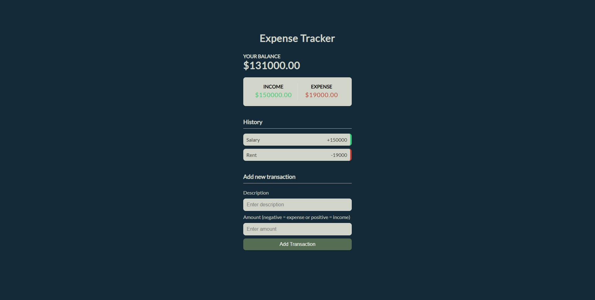

## Express.js Expense Tracker
This expense tracking application runs on an Express.js server and allows the user to log income and expenses.

## Screenshots


## Tech/framework used
- [Express.js](https://expressjs.com/)

## Installation
1. Clone the project:
```
git clone https://github.com/codecventer/express-expense-tracker.git
```
2. Install dependencies on server application:
```
npm install
```
3. Start the server:
```
npm run dev
```
4. Open localhost in your browser.

## API Reference
- [Express.js](https://expressjs.com/en/4x/api.html)

## How to use?
Once you open the application on localhost, you can simply enter an expense or income description in the relative text field before entering the amount. Please note, for income, enter a positive amount and for expenses enter a negative amount. 

After logging an expense or income, you can delete it by hovering on the left hand side of the entry whereby a red cross will appear which by clicking it, will deleted the specific entry.

## Author
- [Christiaan Venter](https://github.com/codecventer)
